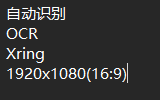
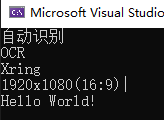

# OneOCR

## 使用说明

1. **编译后不能直接运行！**
   - 请先将 `OCR.7z` 压缩包中的所有内容解压到程序的运行目录（与可执行文件同级）。
   - 未解压OCR.7z内容将导致程序无法正常识别图片。

2. **示例目录结构**

  

  

- `OneOCR/777.bmp`：待识别的图片示例。
- `OneOCR/Result.png`：识别完成后的结果图片。

请确保上述步骤和目录结构正确，否则程序将无法正常工作。